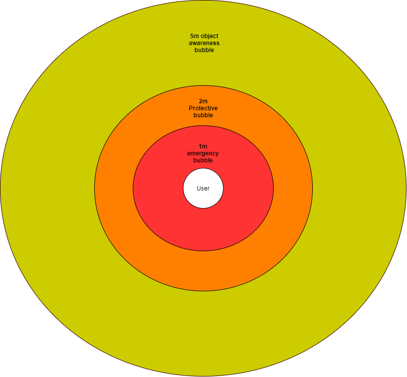
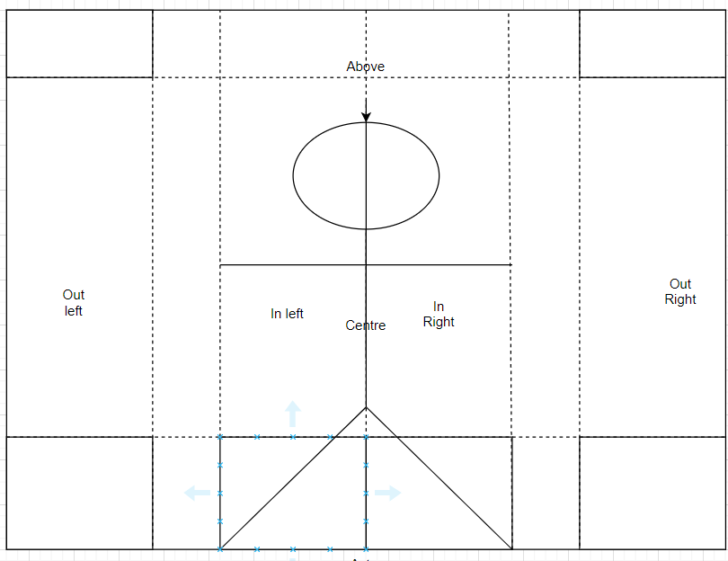
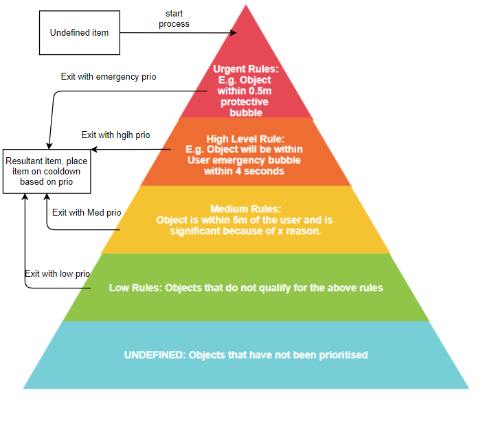

# Prioritiser
## Overview
When designing the solution, we realised that in many cases, such as in automated cars, data output from inference classification is fast and largely disorganised. Unlike computers in cars, the communication delay from system to the user can interfere with their response or action, rapid data flow would likely lead to high cognitive load. Hence, the idea of a data prioritise was integrated into the system. This modular component is a heuristic based AI the aims to analyse and understand the items classified by the inference modules. It is key for our proof of concept to understand the way that the visually impaired interact with their environments. We gained this understanding through our own research and through advice from our research partners at UCLIC. The component aims to process all the input data to tailor relevant assistive data for the user. Hence, this component acts as the ”assistant” or core processor of the service.

The system categorises the data into four priorities (Urgent, High, Medium and Low) based on aset of rule levels of the same name. The items are processed individually through levels of decision functions to determine a final priority. This can be seen in the figures below, focusing on objects size and distance. The Prioritiser has been designed with inheritance/interfacing to allow for modularity allowing future developers to create custom modules for other use cases. In our case the modules were designed to support the Sight++ PoC.Next, object tracking data was integrated into the prioritiser inclusive of speed analysis. It allowed the Prioritiser to understand new and known objects and manage the priority respectively. The prioritiser can now manage obstacle avoidance as well as detection. It does this by first prioritising for objects that may cause collisions and then, prioritising for significant environmental objects the user should be aware of.

Finally, the rules were formalised to follow specific principles. Invisible protective bubbles and locations were enforced around the user, this can be seen in visual section, different bubbles help trigger different priorities. User feedback is also incorporated into the system for choice of object classes to prioritise. This opens a communication channel which allows more independence for the user and gives the user more control on the data they receive. Finally a dynamic time-based system was implemented into the Prioritiser that results in known objects only being repeated aftera cool-down period or if any significant change occurs with the known object. This cool-downperiod reduces stress on the user by not repeating recent information too often.
## Documentation
This section will be a brief overview for understanding and future development of the core components of the Prioritiser.
### Components
#### Communication Controller (Priortiser.hpp)
-   Firstly, we have the Prioritiser interface. This manages the communication with the Service Control Module. This is in the prioritser.hpp file.
- When the system starts, all the different modules/versions of the Prioritiser are loaded into an array on the communication interface. Based on modes the specific Prioritiser is then chosen. This is the loaded as the main Prioritiser on the communication interface.
- Whenever the service now communicates to the communication interface it will choose said Prioritiser.

#### Priority module interface (Priority Module.hpp)
- This module is the class interface for each module. Each different module of the Prioritiser should inherit this class.
- This interface has the method to run the actual Prioritiser named "run". This interface also contains the array of classes that the user has given to the service that they want to prio.
- Finally, this interface contains the function the executes the functions that are called in the child node and clears the list of objects from the last frame.

#### Smart priority
- This module is the main implementation of the base Prioritiser. It follows a linear path that leads to a priority
of either Urgent, high, medium or low. Each item is processes individually and following priority it is added to the resultant array.
- This Prioritiser uses the object tracking system from the ML module. Priority is given to objects based on distance, speed, location within the frame, and how long the item has been present. The rules follow a bubble pattern as we can see in the figure section. Objects such as users entering these different bubbles results in the item getting a higher priority.
- If an item is prioritised and is sent to the interface, that item is then put on cool-down for a few seconds based on the priority. The item is only prioritised and sent again when it comes off cool-down or if the item state changes and breaks significant priority rules.

#### Covid Priorty
- This system follows a similar to the smart module. There is only the small different of the rules focusing on the government rules of social distancing such as being 2 or more meters away from people.

#### Priority Clock
Finally, this class manages the cool-down system discussed above. The object is structured around an unordered list for optimal retrieval. Items are place in the map with system time as value and class+id as a unique key. The values are then checked against the newer system time to see if enough time has passed for it to be off cooldown.

### Design Decisions
- What are key decisions that were taken with the module and why? Are there other options and why were they not taken?
- Notably different to the other modules is the Prioritiser is significantly less structured and more open in its design. This allows for the full customisation of how it prioritises the data. It does lead to more work for building new modules but i believe the customisability is more important in this case.
- The use of 4 levels was rather significant in terms of priority. This was done to make the communication structure simpler and more straightforward when pushing the data forward. We hope in the future the system become more dynamic and powerful.

### Limitations

- The 3 layer structure of the classes in the Prioritiser allows for a high amount of customisability. It does however lead to some issues with understanding the logical flow when developing the system. This could be addressed in the future.

- One issue is that perhaps there should be even more inheritance as similar modules that use the rule system currently have code duplication. At the time of development, it was argued that this was balanced out but the customisability that the it allowed as a trade-off. However, in hindsight this could be better structured to be a compromise of both.
  - Finally, the current Prioritiser mostly looks at items individually. Adding a group analysis would be bennifical for certian use cases.

### Visuals and diagrams
- Any design diagrams or screen shot examples.
#### Bubble rules for priority system

#### Location markers within the frame to determine if a user will collide with object

#### Location markers within the frame to determine if a user will collide with object

## Development Manual
What do future developers need to understand here to develop it further?

The best way to develop this module is to create a new Prioritiser instance module that inherits priority module. One can the build a Prioritiser that works in any fashion as long as it returns info correctly (which is will do in through if it complies with the parent class).
### Component Development
- How do I develop this component further? Where do I go?
  - To Develop this system further it is easiest to simple create a new child modules of the "priority module" interface class.
  - However, if you feel the need to adapt the system in its entire the components can be broken down as such:
    - The Prioritiser: The Communication interface so the rest of the system has a standardised protocol to connect to the prirotser.
    - priority_module: The interface class that defines the structure of all Prioritiser modules.
    - smart priority or others: Child classes of priority module. The specific module of the Prioritiser that can be changed in a plug-and-play method.

### Requirements
  - This module uses packages that are found in most of the system and does not have any of its own specific dependencies.
    - SPDLOG
    - GTEST

### Future development
  - There and many many capabilities for the future of this system.
  - To specify a few they could be:
    - Resolving the mentioned limitation above.
    - Creating a Prioritiser system that uses ML.
    - Creating a Prioritiser that can managed the list of object and group them into larger categories for group based analysis. A good example of this would be grouping groups of people into crowds so the use can navigate around the crowd in its entire.
    - Conduct user studies so that the team can better understand how to take the system further. This is something we wanted to do but due to time restraints and covid it became impossible.
